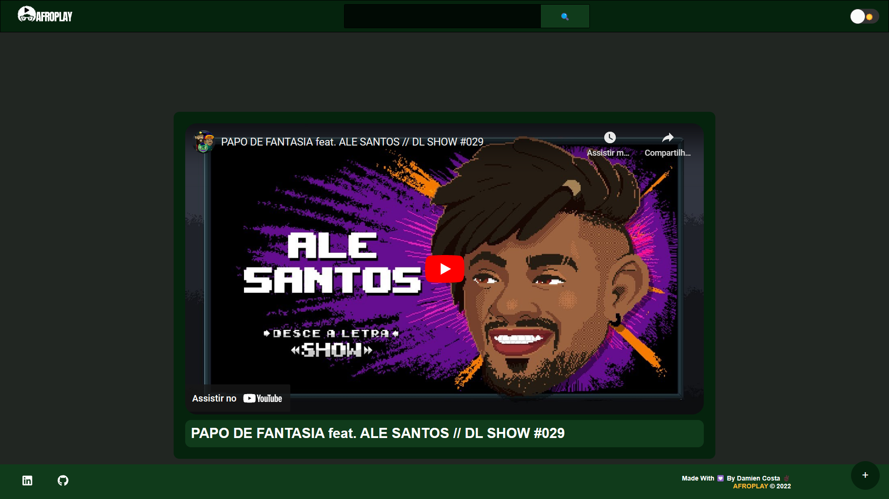

<h1 align="center">AfroPlay</h1>

O AfroWatch é um clone do Youtube que foi desenvolvido durante a Imersão React 5 da Alura.
 
<h3 align="center"><a href="https://afroplay.vercel.app/" target="_blank"><strong>[ USE AGORA ]</strong></a></h3>

---

 

  
  

## 💻 Projeto

Este projeto foi desenvolvido em React e nele você pode guardar videos do youtube, assisti-los e organiza-los em playlists.

## 🚀 Tecnologias

As seguintes ferramentas foram usadas na construção do projeto:

- [NextJs]
- [ReactJs]
- [Javascript]
- [HTML]
- [CSS]

Made with 💟 by Damien Costa ✌🏿

<a href="https://www.linkedin.com/in/damien-costa/" target="_blank">
